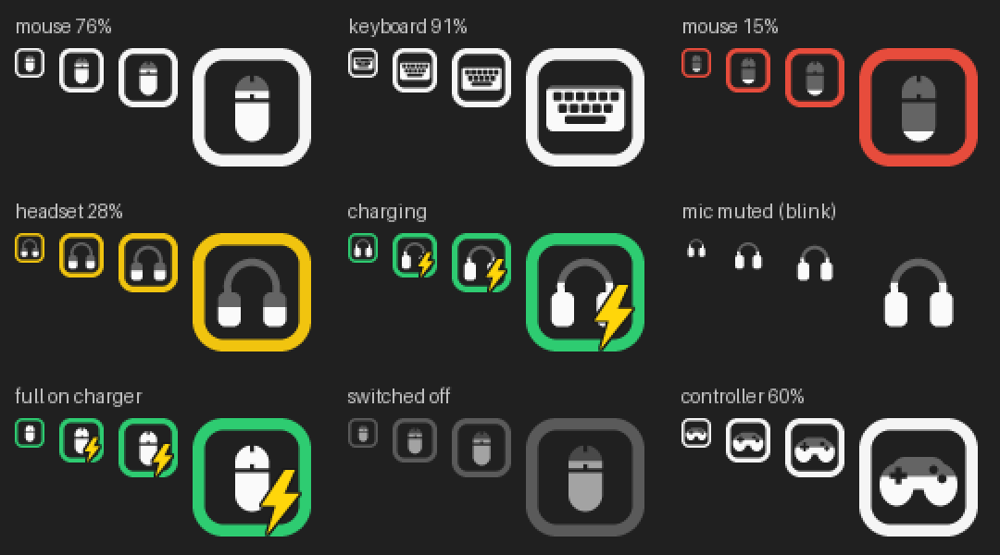

# Peripherals Battery

A tiny Windows tray app that shows the battery of your wireless gear — mouse,
headset, keyboard, controller — as one small icon each, without G HUB, Synapse,
NGENUITY or any other vendor software running.



Each icon is a **pictogram of the device** that fills up like a glass with its
battery level, inside a **colour-coded frame**:

| Frame | Meaning |
|---|---|
| white (charcoal on a light taskbar) | fine |
| yellow | 20–33 % |
| red | below 20 % |
| green + ⚡ | charging (or full and still plugged in) |
| blinking (headsets) | microphone muted |
| whole icon grey | device switched off, asleep or unplugged — its last level is kept |

Hover for the exact numbers, e.g. `PRO Wireless: 76% - ~31h left`.
All thresholds can be changed in `settings.json`.

## Features

- **One icon per device**, each with its own pictogram (mouse / headset / keyboard / gamepad).
- **Mic-mute blink** for headsets — from the headset's own mute button *and* from
  Windows' microphone mute. Left-click a headset icon to toggle the Windows mic mute.
- **Time remaining / time to full**, estimated from a least-squares fit of the
  current discharge (or charge) session.
- **Notifications**: low battery (once per discharge) and "fully charged, unplug it".
- **Starts with Windows** (switched on at first launch; untick it in the menu).
- **Remembers your devices**: a mouse that is off at boot still gets its grey icon.
- **Settings window**: thresholds, notifications, sources, and a device list where
  you can rename, hide or forget devices - no JSON editing needed.
- **Learn a new device**: a wizard that listens to an unsupported USB dongle while
  you mute/unmute and plug/unplug it, finds the battery, mute and charging bytes,
  and saves them as a shareable recipe.
- **Battery history** in `history.csv` for anyone who wants to chart it.
- **Device recipes**: support for a new request/reply headset is a few lines of JSON, no code.
- `--once` / `--json` for scripts and widgets, `--probe` for diagnostics.
- **Light on resources**: one battery read a minute, event-driven everywhere else;
  measured at ~0.005 % of one CPU core and ~30 MB RAM while idle.

## Supported devices

| Family | How it is read | Examples |
|---|---|---|
| Logitech (LIGHTSPEED, Unifying, Bolt, USB cable) | HID++ 2.0 battery features 0x1000 / 0x1001 / 0x1004 | **G PRO Wireless**, G305, G502 LIGHTSPEED, G703/G903, MX Master, G915 |
| HyperX, Kingston dongle | vendor protocol, including mute and charging reports | **Cloud Flight S**, Cloud II Wireless (0951:1718) |
| HyperX, HP dongle | recipe | Cloud II Wireless (03F0:0696/018B), Cloud Alpha Wireless |
| Razer (HyperSpeed / Pro dongles) | Razer 90-byte feature report, transaction id auto-detected | DeathAdder V3 Pro, Viper V2 Pro, Basilisk V3 Pro, BlackShark V2 Pro |
| SteelSeries | recipes | Arctis 7 / Pro / 9 / 1 / 7X / 7P, Arctis Nova 5 / 7 |
| Corsair | recipe | Void / Void Pro / Void Elite / HS70 Wireless |
| **Any Bluetooth device** Windows knows the battery of | `DEVPKEY_Bluetooth_Battery` | **Keychron K8 Pro** and other BT keyboards, AirPods, Sony WH-/WF-, Turtle Beach BT headsets, MX Keys |
| Xbox-compatible controllers + their headsets | XInput (4 coarse levels) | Xbox pads, most 2.4 GHz third-party pads, Xbox headsets on a pad |
| 100+ more headsets | optional [HeadsetControl](https://github.com/Sapd/HeadsetControl) bridge | Logitech G533/G935/PRO X, Roccat, Audeze, … |

> **Honesty note.** The protocols come from well-established open-source
> implementations (see Credits) and are covered by protocol-level tests against
> simulated devices. Not every device in this table has been tried on real
> hardware yet. If yours misbehaves, run `PeripheralsBattery.exe --probe` (or
> `python -m peribatt --probe`) and open an issue with the output.

**Keychron K8 Pro:** it connects over Bluetooth (or a cable), and Windows reads its
battery through the Bluetooth battery service, which is what this app shows. On a
cable there is no battery to report.

**Turtle Beach and others:** Bluetooth models work through the Bluetooth path,
and Xbox-style ones through XInput. USB-dongle models without a public protocol
can be added as a recipe once someone captures the reports (see
[docs/adding-devices.md](docs/adding-devices.md)).

## Install

**Installer (recommended):** download `PeripheralsBattery-X.Y.Z-setup.exe` from
[Releases](../../releases/latest) and run it. It installs for your user only (no
admin prompt), adds a Start menu entry, and asks whether to start with Windows.
Uninstall from *Settings > Apps* as usual.

**Portable:** download `PeripheralsBattery-X.Y.Z-windows.zip`, unzip it somewhere
permanent (e.g. `C:\Tools\PeripheralsBattery`) and run `PeripheralsBattery.exe`.
It adds itself to startup the first time.

If Windows SmartScreen says "Windows protected your PC", the build is unsigned:
choose *More info > Run anyway*. See [docs/signing.md](docs/signing.md) for how
releases get signed.

**From source** (Python 3.10+):

```bat
pip install -r requirements.txt
pythonw peribatt.pyw
```

**Build the .exe yourself:** `build.bat` → `dist\PeripheralsBattery\`.

Close vendor apps that hold the device exclusively if a device doesn't show up
(G HUB and Synapse usually coexist fine).

## Tray menu

Settings… · Learn a new device… · Refresh now · Poll interval (30 s – 5 min) ·
Low battery alert (off, 10–25 %) ·
Display (percentage instead of picture, mute blink, Windows mic mute, full-charge
notification) · Sources (Bluetooth, controllers) · Hide this device · Forget
disconnected devices · Open data folder · Start with Windows · Exit

## Command line

```text
python -m peribatt                 run the tray app
python -m peribatt --once [--json] print all devices once
python -m peribatt --probe         diagnostics report for bug reports
python -m peribatt --learn         the learn-a-device wizard on its own
python -m peribatt --autostart on  start with Windows (or: off)
```

Settings, `history.csv`, extra `recipes.json` and the log live in
`%APPDATA%\PeripheralsBattery`.

## How it works

```
sources (one per protocol)                 app core                 front end
┌─────────────────────────┐   Readings   ┌───────────────┐  images  ┌──────────┐
│ hidpp  (Logitech)       │──┐           │ merge, colour │ tooltips │ pystray  │
│ hyperx (push + poll)    │──┤  poll /   │ rules, alerts,│─────────▶│ one icon │
│ razer, recipes (JSON)   │──┼─ events ─▶│ history, mute │  menus   │ per      │
│ bluetooth, xinput, hsc  │──┘           │ blink         │          │ device   │
└─────────────────────────┘              └───────────────┘          └──────────┘
```

- `peribatt/model.py` — the `Reading` every part agrees on.
- `peribatt/app.py` — the core, independent of the tray library (tested with a fake backend).
- `peribatt/render.py` — vector pictograms, drawn 4× and box-filtered down; results are cached.
- `peribatt/hidpp.py`, `hyperx.py`, `razer.py`, `recipes.py`, `bluetooth.py`, `xinput.py`, `hsc.py` — the providers.
- `peribatt/micmute.py` — Windows Core Audio via raw COM (ctypes, no pywin32).
- `peribatt/prefs.py` + `settings_ui.py` — the settings window (logic / widgets).
- `peribatt/learn.py` + `learn_ui.py` — the learn wizard (capture and analysis / widgets).
- `peribatt/ui.py` — a Tk thread that only exists while a window is open.
- `installer/` — Inno Setup script and the signing step used by CI.

Efficiency choices: the HyperX reader threads block on the device and wake only
for data; the blink thread sleeps until a mic is muted; Bluetooth is scanned every
2 minutes and HeadsetControl every 5; icons are rendered once per state and turned
into Windows icon handles once (cached); menus are rebuilt only when their text
changes; the one-folder build avoids unpacking a one-file .exe at every boot.

## Development

```bash
pip install -e ".[dev]"
ruff check . && pytest -q
python docs/make_preview.py      # regenerate docs/icons.png
```

The tests run on Linux and Windows (CI does both; on Linux the windows are drawn
on a virtual display with `xvfb-run`). The device protocols are tested against
fake devices in `tests/fakes.py`, the whole app is started and exited through a
fake `pystray`, the settings window and the learn wizard are driven click by
click, and on Windows the native API bindings are exercised for real.

**Releasing:** bump `peribatt/__init__.py`, then push a tag `vX.Y.Z`. CI builds
the app, smoke-tests it, signs it (when a certificate is configured), builds the
installer and attaches both to a GitHub release.

## Credits / prior art

- The idea of a per-device tray battery icon was inspired by
  [HaloBattery](https://github.com/HeyOkay/HaloBattery) (MIT). This project is a
  separate implementation with its own design.
- Cloud Flight S / Cloud II Wireless protocol:
  [HyperHeadset](https://github.com/LennardKittner/HyperHeadset) (MIT) and
  [hyperx-cloud-flight-s-battery-monitor](https://github.com/CubE135/hyperx-cloud-flight-s-battery-monitor) (MIT).
- Headset request/reply layouts used in the recipes: [HeadsetControl](https://github.com/Sapd/HeadsetControl).
- Logitech HID++ and the Li-ion voltage curve: [Solaar](https://github.com/pwr-Solaar/Solaar).
- Razer report format: [OpenRazer](https://github.com/openrazer/openrazer).

## License

MIT
